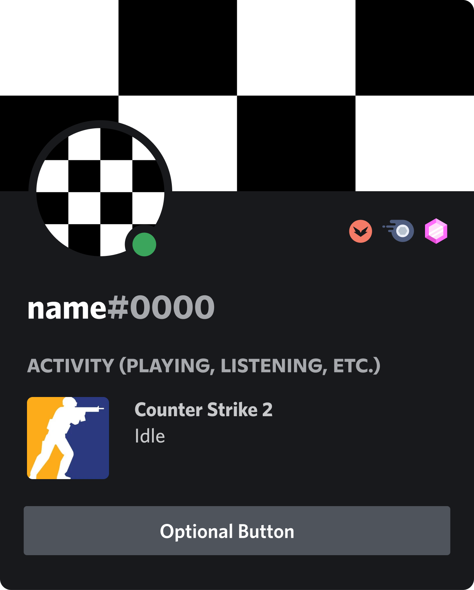
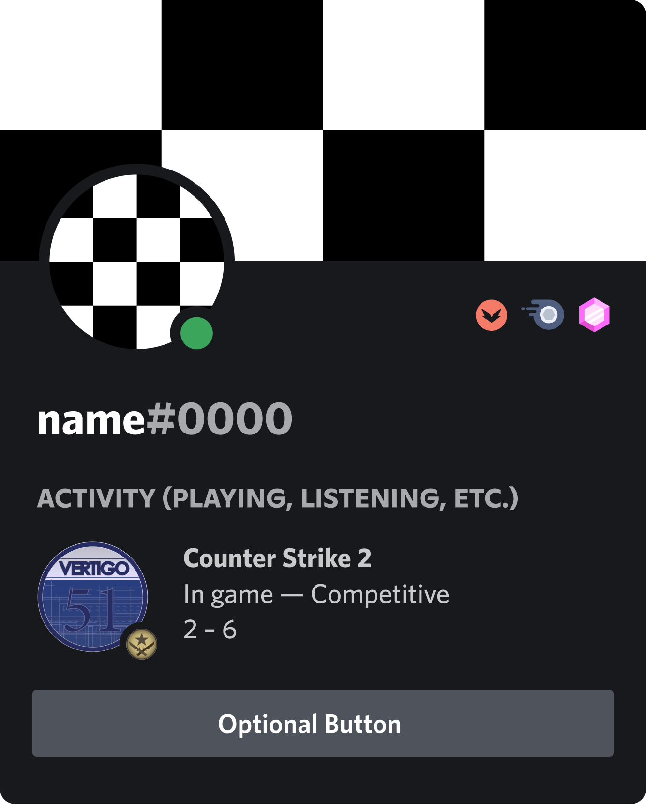

# 🎮 Rich Presence for Counter Strike 2

## 📝 Description
This project provides a detailed Rich Presence integration for Counter Strike 2 (CS2) with Discord.

### What's Rich Presence?
Rich Presence is a feature of Discord that allows applications to share real-time information about a user's activity
It allows players to display their in-game status, including the current map, score, and other relevant information, directly on their Discord profile.

 
*Example of Rich Presence in Discord for League of Ledgends*

## ✨ Features
- 🗺️ Shows the current map and game mode
- 🏆 Displays the overall score
- 🎯 Indicates if the player is in a match or in the lobby

## Prototype

  
  

